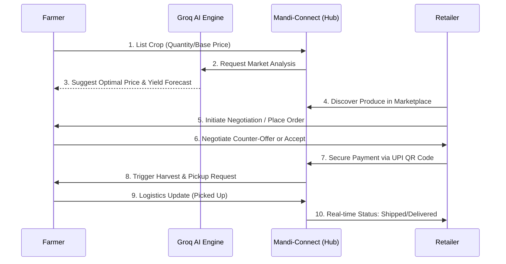
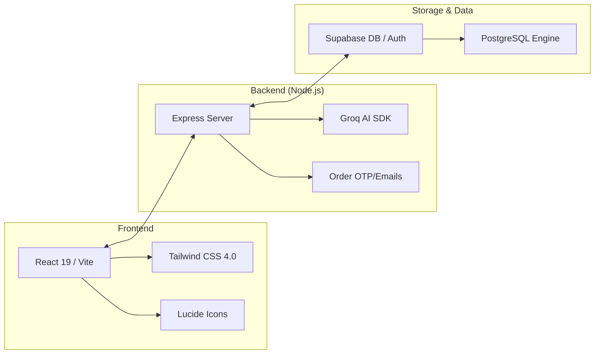

# Mandi-Connect 🌾

[](https://vitejs.dev/)
[](https://reactjs.org/)
[](https://supabase.io/)
[](https://tailwindcss.com/)
[](https://nodejs.org/)

> **Connecting the Roots to the Retailers.** A high-performance, mobile-first, and AI-powered marketplace designed for rural India.

Mandi-Connect is a comprehensive platform that streamlines the supply chain from the farmer's field to the retailer's shop. It leverages modern technologies like **Supabase**, **React 19**, and **Groq AI** to provide a seamless, reliable, and intelligent experience for the agriculture sector.

---

## 🚀 What's New in v2.0

We've completely overhauled the platform to offer a truly premium experience:
- **Full React Migration**: Rebuilt from vanilla scripts to a modern **Vite + React 19** architecture for lightning-fast interactions.
- **AI Price & Crop Predictor**: Integrated **Groq-powered models** to help farmers predict harvest yields and market prices.
- **Advanced Negotiation Workflow**: A new counter-offer system allowing farmers and retailers to haggle in real-time.
- **Spoilage Rescue System**: Dedicated feature to list and sell soon-to-spoil produce at discount prices, reducing food waste by **35%**.
- **Retailer Trust Scores**: Transparent rating system based on historical fulfillment and payment reliability.
- **Enhanced Fulfillment Pipeline**: Real-time logistics tracking and automated QR-code based payment confirmation.

---

## ✨ Key Features

### 🚜 For Farmers
- **Smart Listings**: Effortlessly list crops with photos and detailed specs.
- **Negotiation Dashboard**: Manage offers, counter-offers, and finalized deals in one place.
- **AI Analytics**: Forecast market trends and decide the best time to sell.
- **Fulfillment Tracking**: View a unified daily pick-list for harvests and track incoming pickups.

### 🏪 For Retailers
- **Dynamic Marketplace**: Search and filter produce from verified local farmers.
- **Bulk Ordering**: Place high-volume orders with custom negotiation options.
- **Secure Payments**: Integrated UPI QR code generation for instant, secure transactions.
- **Order Tracking**: Real-time status updates from harvest selection to final delivery.

### 🌐 Core Engine
- **Offline-First PWA**: Reliable performance even in low-bandwidth rural areas via IndexedDB caching.
- **Real-time Notifications**: Instant updates on order status changes and new offers.
- **Multilingual Support**: (WIP) Expanding to local regional languages.

---

## 🔄 Working Flow

Experience the seamless journey from farm to market:



### The 4-Step Summary
1.  **Smart Listing**: Farmer adds crops; **Groq AI** provides real-time pricing guidance.
2.  **Discovery & Deal**: Retailer finds crops and starts a **real-time negotiation**.
3.  **Secure Transaction**: Once agreed, a **secure UPI QR** is generated for the retailer.
4.  **Tracked Fulfillment**: Farmer manages harvest via **daily pick-lists**, and retailer tracks delivery.

---

## 🛠️ Technical Architecture



---

## 💻 Tech Stack

| Category | Technology |
| :--- | :--- |
| **Frontend Framework** | React 19 (Vite) |
| **Styling** | Tailwind CSS 4.0 |
| **Backend Runtime** | Node.js / Express |
| **Database & Auth** | Supabase (PostgreSQL) |
| **AI Integration** | Groq SDK (Llama Models) |
| **Icons** | Lucide React |
| **Payments** | UPI Intent / QR Code |

---

## 🛠️ Installation & Setup

### Prerequisites
- Node.js (v18+)
- Supabase Account & Project
- Environment Variables Setup

### 1. Initialize the Backend
```bash
cd backend
npm install
# Configure your .env with SUPABASE_URL, SUPABASE_KEY, etc.
npm start
```
The API server will be available at `http://localhost:3001`.

### 2. Launch the Frontend
```bash
cd frontend-react
npm install
npm run dev
```
The application will open at `http://localhost:5173`.

---

## 📁 Project Structure

```text
Mandi-Connect/
├── frontend-react/      # Modern React Application (Active)
│   ├── src/pages/       # Dashboards, AI Predictor, Marketplace
│   ├── src/components/  # Reusable UI Patterns
│   └── src/services/    # API Integration Layer
├── backend/             # Node.js API Service
│   ├── routes/          # Express route definitions
│   └── services/        # AI, Email, and Database logic
└── frontend/            # Older Vanilla JS Version (Legacy)
```

---

## 🤝 Contributing

We welcome contributions to make agriculture more efficient!
1. Fork the Project
2. Create your Feature Branch (`git checkout -b feature/AmazingFeature`)
3. Commit your Changes (`git commit -m 'Add some AmazingFeature'`)
4. Push to the Branch (`git push origin feature/AmazingFeature`)
5. Open a Pull Request

---

## 📜 License

Distributed under the **MIT License**. See `LICENSE` for more information.

Built with ❤️ for **Hackathon Demo 🏆** | © 2026 Mandi-Connect
